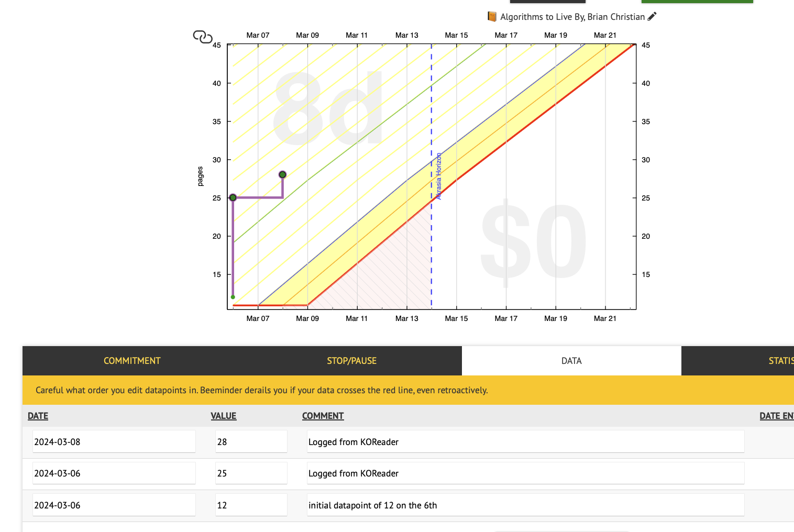

# beeminder.koplugin

This is a small [koreader](https://koreader.rocks) plugin that automatically logs your
reading progress to [Beeminder](https://www.beeminder.com).

Whenever you read more pages in your favorite book, the plugin will update your Beeminder
goal with the new value. If you've already read a little bit today, it will just
update that datapoint; otherwise, it will add a brand new datapoint!

